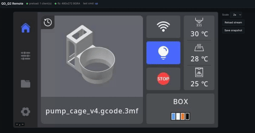

# Qidi Q2 Remote (touchscreen)

Remote control for the Qidi Q2 printer UI when the touchscreen is dead. Runs the stock GUI binary untouched, feeds it fake input events, and streams the framebuffer to a browser so you can click it from your laptop.



## Why

Qidi Q2 ships with a touchscreen. Mine wasn't working from the beginning (no backlight, no reaction to device plugged in to the USB port). The kernel on this unit has no `uinput`, so I can't just create a virtual evdev device the normal way. I also didn't want to patch or replace the proprietary GUI (implemented by `/home/mks/QD_Q2/bin/client` file).

So instead:

- `LD_PRELOAD` library intercepts `open("/dev/input/event0", ...)` inside the GUI binary and hands it back a pipe we control.
- A small Python service reads `/dev/fb0` at a few FPS, serves it as MJPEG, and listens for clicks from the browser.
- Clicks get turned into normal `struct input_event` records and written into the pipe. The GUI reads them as if they came from a real touchscreen.

## What's in here

```
preload/     C source + Makefile for the LD_PRELOAD shim
python/      aiohttp service + browser UI
scripts/     install.sh, start.sh wrapper, systemd unit
```

## Requirements

On the printer:

- Debian 11 or similar, aarch64, glibc
- Python 3.9+
- [`uv`](https://docs.astral.sh/uv/) for venv management
- read access to `/dev/fb0`

For building the `.so`, either:

- build on the printer directly (`apt install build-essential`)
- cross-compile with `gcc-aarch64-linux-gnu` on a dev machine.

### Cross-compilation
If you don't want to install a toolchain on the printer:

```
apt install gcc-aarch64-linux-gnu
make -C preload CC=aarch64-linux-gnu-gcc
```

Check the result:

```
file preload/qd2_remote_input.so
# ELF 64-bit LSB shared object, ARM aarch64, ...
```

*Note:* if your host glibc is much newer than the printer's, the resulting `.so` may pull in symbols that don't exist on the device. Safest way is to build on the printer itself, or use a Debian 11 host (with glibc 2.31).

## Install

Copy the repo to the printer, then:

```
sudo bash ./scripts/install.sh
```

The script asks whether to build the preload library locally or use a prebuilt one. It then:

- installs `qd2_remote_input.so` to `/home/mks/`
- creates a venv in `/opt/qd2-remote/venv` (via `uv`)
- installs the Python web service to `/opt/qd2-remote`
- drops a systemd unit at `/etc/systemd/system/qd2-remote.service`
- replaces `/home/mks/QD_Q2/bin/start.sh` (the old one is kept as `start.sh.bak`)

If `uv` is in your user home, pass its path through sudo:

```
sudo UV_BIN=/home/mks/.local/bin/uv ./scripts/install.sh
```

## Run

```
sudo systemctl enable --now qd2-remote.service
```

Then restart the Q2 GUI (reboot, or whatever you normally do). Open:

```
http://<printer-ip>:18080/
```

Click, drag, whatever. The browser UI shows connection status for both the framebuffer and the preload socket.

## Configure

Environment variables, picked up by the systemd unit:

| var | default | what |
|---|---|---|
| `QD_HTTP_HOST` | `0.0.0.0` | HTTP bind address |
| `QD_HTTP_PORT` | `18080` | HTTP port |
| `QD_REMOTE_INPUT_SOCK` | `/run/qd2-remote-input.sock` | IPC socket |
| `QD_REMOTE_DEBUG` | unset | preload debug logs to stderr |

Port and host also accept `--port` / `--host` on the command line if you run the service manually.

## Security

There's no auth. Don't expose it to the open internet. If you need LAN access, put it behind an SSH tunnel, reverse proxy with basic auth, or Tailscale.

## Troubleshooting

**Browser shows a black screen.** Usually a pixel format mismatch. Check `/health` — the service reports the format it picked. The fb read order is `BGRA → BGRX → RGBA → RGBX`.

**Clicks do nothing.** Check `/health` → `preload_clients`. If zero, the GUI wasn't launched with `LD_PRELOAD`, or the socket path doesn't match. Confirm `start.sh` is the replaced version.

**GUI crashes on start.** Turn on `QD_REMOTE_DEBUG=1` in `start.sh` and re-run. The preload lib will log every intercepted call. If a new `ioctl` shows up that isn't emulated, open an issue with the request number.

**`uv not found` under sudo.** `sudo` strips `PATH`. Pass `UV_BIN=/path/to/uv` or `sudo env "PATH=$PATH" ./scripts/install.sh`.

## License

[LICENSE](LICENSE)
